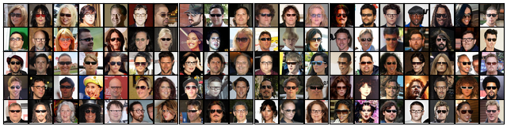
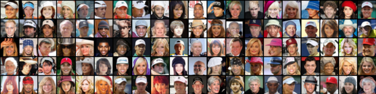
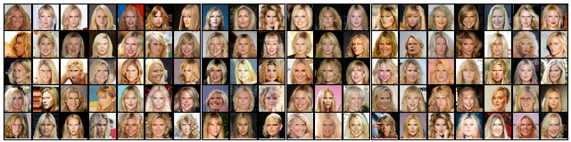
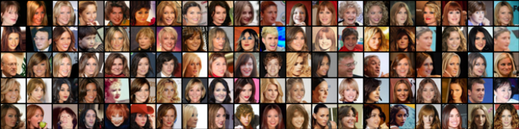
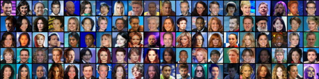
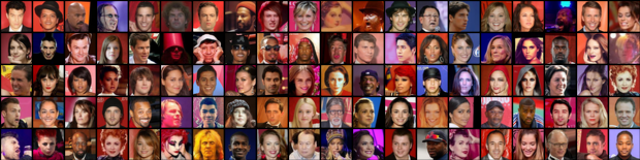

# Bidirectional-InfoGAN

For further details on the network architectures and the hyperparameters used during the experiments see: [Architectures and Hyperparameters](./architectures/network-architectures.pdf)

[Additional Results](#Additional_Results)  

<a name="Additional_Results"/>
## Additional Results
<a name="Additional Results: MNIST"/>
### MNIST Data Set
Additional samples according to the individual values of the categorical variable c1:

Additional samples from the continuous variable c2 (stroke width):
uneven rows show the samples according to the minimum values, even rows show samples according to the maximum values of c2 of each categorical value

Additional samples from the continuous variable c3 (digit rotation):
uneven rows show the samples according to the minimum values, even rows show samples according to the maximum values of c3 of each categorical value

<a name="Additional Results: CelebA"/>
### CelebA Data Set
Images with high confidence on the presence of glasses:

Images with high confidence on the presence of hats:

Images with high confidence in blond hair:

Images with high confidence in a woman looking to the right:

Images with high confidence in blue background:

Images with high confidence in red background:

<a name="Additional Results: SVHN"/>
### SVHN Data Set

<a name="Images from the Paper"/>
## Images from the Paper
<a name="MNIST"/>
### MNIST Images

<a name="CelebA"/>
### CelebA Images

<a name="SVHN"/>
### SVHN Images

