# Bidirectional-InfoGAN
Implementation and additional results of "Inferencing Based on Unsupervised Learning of Disentangled Representations".

The work presented here was done at the [Knowledge Technology Research Group](https://www.inf.uni-hamburg.de/en/inst/ab/wtm/ "Knowledge Technology Research Group") at the University of Hamburg and accepted as a conference contribution to the [ESANN 2018](https://www.elen.ucl.ac.be/esann/).

Contents:
* [Run Experiment](#to-run-the-experiment-on-mnist-data-set)
* [Architectures and Hyperparameters](#architectures-and-hyperparameters)
* [Additional Results](#additional-results)
    * [MNIST Data Set](#mnist-data-set)
        * [Categorical Variables](#categorical-variables)
        * [Continuous Variables](#continuous-variables)
        * [Wrongly Classified Images](#wrongly-classified-images)
    * [CelebA Data Set](#celeba-data-set)
        * [Categorical Variables](#categorical-variables-1)
        * [Continuous Variables](#continuous-variables-1)
    * [SVHN Data Set](#svhn-data-set)
        * [Categorical Variables](#categorical-variables-2)
        * [Continuous Variables](#continuous-variables-2)
* [Images from the Paper](#images-from-the-paper)
     * [MNIST Images](#mnist-images)
     * [CelebA Images](#celeba-images)
     * [SVHN Images](#svhn-images)

## To Run the Experiment on MNIST Data Set
Requirements:
* Tensorflow 1.5.0
* Numpy 1.14.1

Run Experiment:
* run `python code/train_mnist.py`
Results are stored in code/log_dir/mnist
* to visualize results: `tensorboard --logdir code/log_dir/mnist`
* for each experiment run log_dir also contains two folders (samples_cont and samples_disc) in which samples from the validation set that maximally activate each disentangled variable are stored at each logging step

To evaluate the results:
* run `python evaluate_model.py --model_dir dir-where-model-weights-are-stored` with one of the following flags:
    * `--evaluate`: evaluates the encodings' accuracy on the MNIST test set. Needs a file "encodings.txt" (stored in the same dir as --model_dir) which gives the mappings from the learned encodings to the actual labels. Use for example the images from the directory samples_disc to find the right mappings. E.g. for the following image the encodings.txt file would look as following: `6,5,9,2,1,8,3,0,4,7`, since the sixth row encodes zeros, the fifth row encodes ones, the last (ninth) row encodes twos, etc
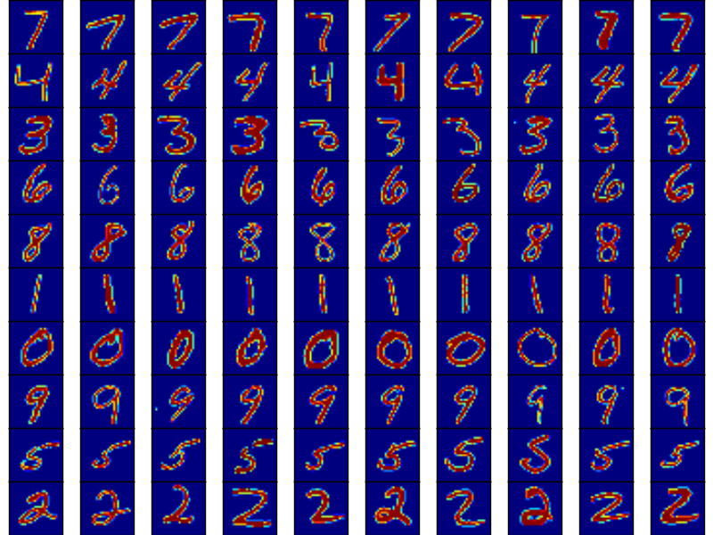
    * `--sample`: samples images from the test set according to their values in the categorical and continuous variables of z. Samples are stored in model_dir/samples (samples_categorical.png, sample_cont_c1.png, sample_cont_c2.png)
    * `--reconstruct`: samples twenty images X of each class from the test set and reconstructs them, i.e. G(E(X)). Result is stored in model_dir/samples/samples_reconstruction.png, where the uneven columns (first, third, ...) depict the original images and the even columns depict the respective reconstructions
    * `--generate`: generates new samples according to the different categorical values. Results are stored in model_dir/samples/generated_imgs_categorical.png

## Architectures and Hyperparameters
For further details on the network architectures and the hyperparameters used during the experiments see [Architectures and Hyperparameters](./architectures/network-architectures.pdf).

## Additional Results
### MNIST Data Set
#### Categorical Variables
Additional samples according to the individual values of the categorical variable c1:

#### Continuous Variables
Additional samples from the continuous variable c2 (stroke width):
uneven rows show the samples according to the minimum values, even rows show samples according to the maximum values of c2 of each categorical value
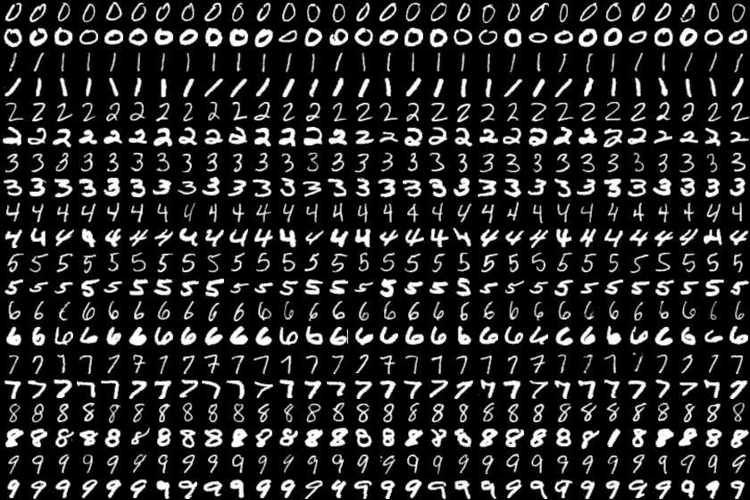

Additional samples from the continuous variable c3 (digit rotation):
uneven rows show the samples according to the minimum values, even rows show samples according to the maximum values of c3 of each categorical value
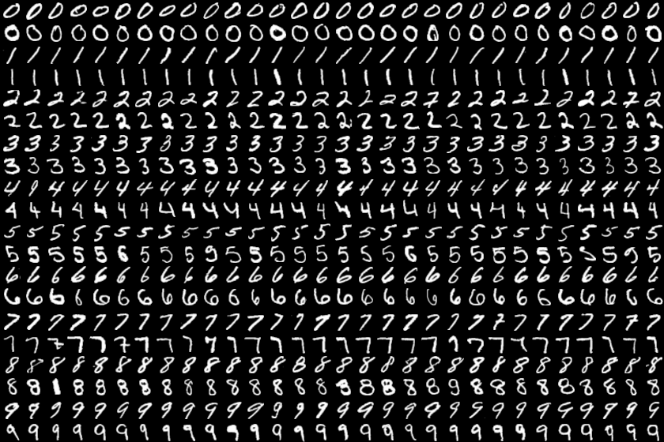

### Wrongly Classified Images
Here we show all images (310) from the MNIST test set that were wrongly classified by our best model (accuracy of 96.99%). For each class 0-9 we show the images that were classified incorrectly with the label that was assigned by our model.
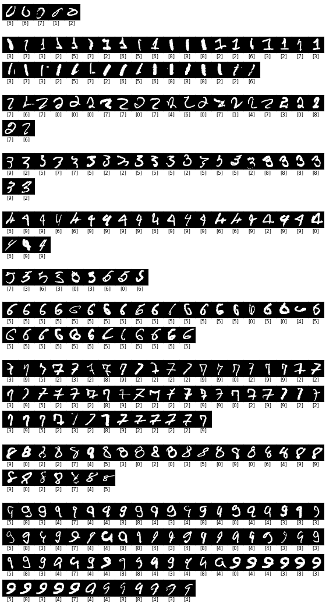

### CelebA Data Set
#### Categorical Variables
Here we show images that are sampled from the CelebA test set according to a categorical value of the variables c1, ..., c4.

Images with high confidence in the presence of glasses:

Images with high confidence in the presence of hats:

Images with high confidence in blond hair:

Images with high confidence in a person looking to the right:

Images with high confidence in a person looking to the left:
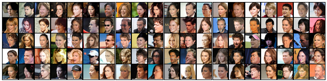

Images with high confidence in a person with a darker skin tone:
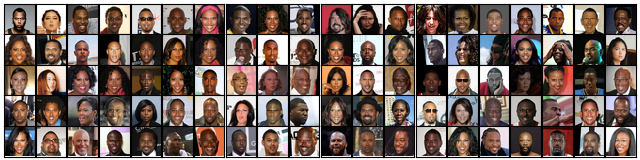

Images with high confidence in a person with their mouth open:
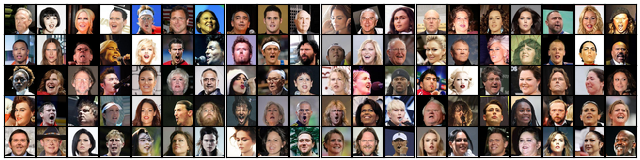

Images with high confidence in blue background:

Images with high confidence in red background:

#### Continuous Variables
Here we show images that are sampled from the CelebA test set according to their value (minimum and maximum) for the continuous variables c5, ..., c8. In each image the first two rows show images where the value of the given continuous variable is small, while the second two rows show images where the continuous variable's value is large.

From not smiling to smiling:  
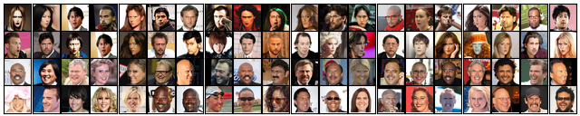

From lighter hair to darker hair:  
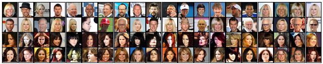

From lighter background to darker background:
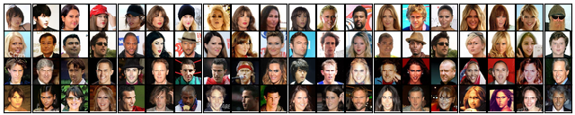

### SVHN Data Set
#### Categorical Variables
Here we show images that are sampled from the SVHN test set according to a categorical value of the variables c1, ..., c4.

Images with multiple digits:  
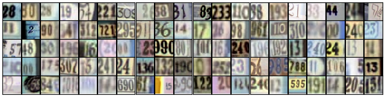

Images with two digits on the left:  
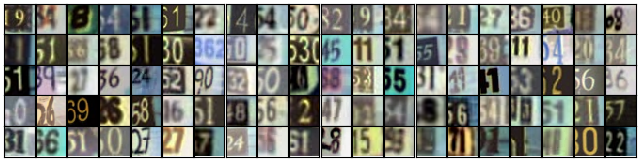

Images with two digits on the right:  
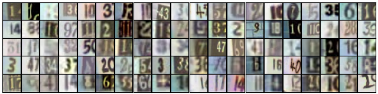

Images with blue background:  
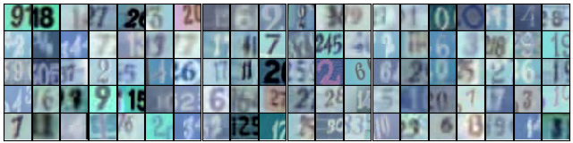

Images with high confidence in "0" or "9" being present:  

Images with a "1" on dark background:  
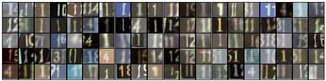

Images with a "1" on light background:  
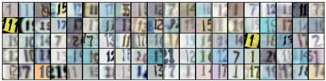

Images with high confidence in "2" or "4" being present:  
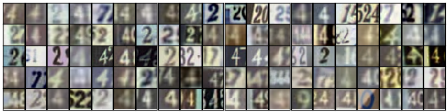

Images with high confidence in "2" or "7" on dark background:  
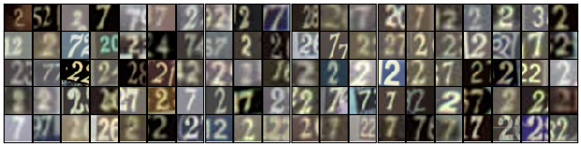

Images with high confidence in "2" or "7" on light background:  
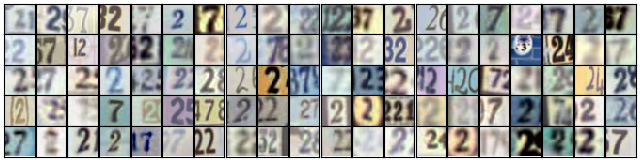

Images with high confidence in "3" or "8" being present:  
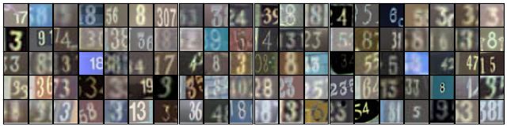

Images with high confidence in a "4" on dark background:  
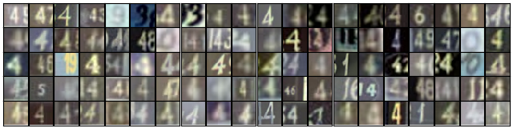

Images with high confidence in a "4" on light background:  
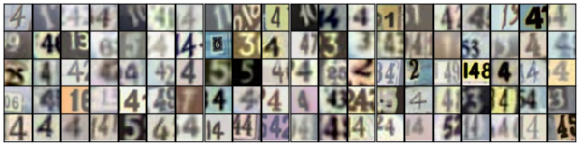

Images with high confidence in "5" or "6" being present:  
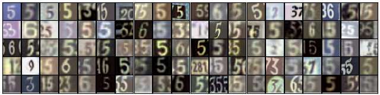

#### Continuous Variables
Here we show images that are sampled from the SVHN test set according to their value (minimum and maximum) for the continuous variables c5, ..., c8. In each image the first two rows show images where the value of the given continuous variable is small, while the second two rows show images where the continuous variable's value is large.

Blue digit to yellow digit:  
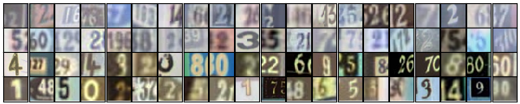

Lighter background to darker background:  
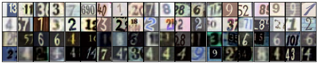

## Images from the Paper
### MNIST Images

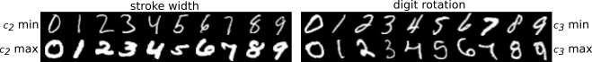

### CelebA Images

### SVHN Images

